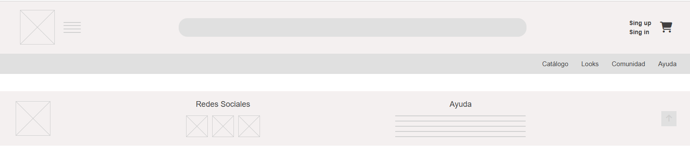

# Grupo 1 equipo Frontend, proyecto: StyleNow
Ecommerce de Moda y Accesorios
## Introducción:
Para comenzar el trabajo colaborativo se estableció una estrategia común de desarrollo para el proyecto StyleNow, aplicable desde el Hito 1 hasta la entrega final del e-commerce.
El equipo se compone de ocho integrantes distribuidos en cuatro disciplinas: UX/UI, Frontend, Mobile y Backend.
Cabe destacar que Frontend, Mobile y Backend poseen repositorios Git independientes, en cada uno de ellos se aplicará la misma política de ramas, commits, Pull Requests, documentación y releases. Esta estrategia busca asegurar que:
1. Se realice trabajo paralelo sin comprometer las versiones estables.
2. Mantener la trazabilidad desde las Historias de Usuario hasta el código.
3. Realizar revisión y pruebas antes de integrar cambios.
4. Mantener la coordinación permanente entre UX/UI, Frontend, Mobile y Backend;
5. Mantener documentación técnica actualizada.
6. Tener la identificación inequívoca de la versión entregada en cada Hito.
7. Propiciar la continuidad de una misma metodología durante todo el desarrollo del e-commerce.
   
 Respecto a GitHub Flow usado en cada repositorio, básicamente la estrategia a utilizar fue:
1. Rama Main como versión estable.
2. Rama Release que representa la versión  del hito a entregar.
3. Rama Develop como rama permanente de integración.
4. Ramas temporales de trabajo y componentes: feature/*, fix/*, docs/* y chore/*.
   La estructura general será:
   
` main <-- release/hito-X <-- develop <-- feature/* <- fix/* docs/* chore/ `

   Ramas y acuerdos:
   
   3.1. Main: Representa la versión estable y oficial de cada aplicación.
			Reglas:
			* No se desarrolla directamente sobre main.
			* No se permiten commits directos.
			* No se permite push directo.
			* No se permite force push.
			* Los cambios ingresan mediante Pull Request.
			* Debe contener solamente código previamente integrado y probado.
			* Cada entrega oficial debe quedar identificada mediante un tag.

   3.2. Release: Representa la versión que será entregada para el hito en cuestión.
   
   3.3.Develop: Representa la versión actual de integración dentro de cada repositorio.
   Reglas:
				* No se desarrolla directamente sobre develop.
				* Todo cambio entra mediante Pull Request.
				* Las nuevas ramas parten normalmente desde develop.
				* Debe mantenerse ejecutable y razonablemente estable.

3.4 Feature: Se utilizan para implementar nuevas funcionalidades. Cada rama debe representar una funcionalidad concreta, preferentemente relacionada con una Historia de Usuario o tarea del Backlog. 
   Formato: feature/<HU>-<descripcion>
## Instalación/Ejecución
Para poder probar la aplicación web, es necesario:
* Clonar este repositorio
* Abrir en Visual Studio Code
* Instalar la extensión Live Server de Visual Studio Code (https://marketplace.visualstudio.com/items?itemName=ritwickdey.LiveServer)
* Dentro de la carpeta raíz del proeycto, hacer clic derecho en el archivo index.html y presionar "Abrir con Open Server Live"
Y luego, en el navegador se abrirá la el archivo index.html correspondiente a la vista Home.
## Desarrollo: 
Arquitectura de Vistas (Navegación)

El desarrollo frontend se basa en la investigación y wireframes del equipo de UX/UI. En este primer hito se construyeron las vistas HTML de baja fidelidad que son las  siguientes: 

**Home** :Pantalla principal con banners de colección, secciones de inspiración y accesos a categorías. 

**detalle-producto** : Página de detalle del producto (variantes de talla/color, stock, guía de tallas y botón de compra). 

**Comunidad** : Galería inspiracional tipo *Lookbook* para ver prendas combinadas y aumentar la venta cruzada. 
```
 grupo-1-frontend/
  ├── .gitignore
  ├── LICENSE
  ├── README.md (archivo de documentación)
  ├── index.html (vista Home)
  ├── PDP.html (vista de Página de Detalle de Producto)
  ├── carrito.html (vista de Carrito de compras)
  ├── catalogo.html (vista de catálogo de productos)
  ├── comunidad.html (vista de review de clientes)
  ├── cambios-y-devoluciones.html (vista de cambios de productos)
  ├── header.html (vista de header de la aplicación web)
  ├── footer.html (vista de footer de la aplicación web)
  ├── componentes.js (archivo javascript que llama al header y footer genérico para que carguen en todas las vistas y además permite el funcionamiento del subnavbar)
  ├── assets/ (carpeta con imagénes)
  │   └── img/
  │       └── HeaderFooter.png
  └── css/
      ├── base.css (css que se repite en todas las vistas)
      ├── header-footer.css (css genérico para header y footer)
      └── views/ (css de cada vista en particular)
          ├── home.css
          ├── pdp.css
          ├── carrito.css
          ├── catalogo.css
          ├── comunidad.css
          └── cambios-y-devoluciones.css
```


## Componentes reutilizables: 
En este hito, el equipo front hizo un primer acercamiento a la identificación e implementación de "componentes reutilizables" en las diferentes vistas, acordando que los componentes son:

* **Header Genérico :** Incluye la barra de navegación principal, buscador y acceso rápido al carrito.
* **Footer Genérico :** Contiene enlace de la tienda, redes sociales y ayuda.


 Cabe destacar que ambos componentes son llamados de forma dinámica desde sus respectivos archivos hacia las distintas vistas HTML para evitar la duplicación de código en la maquetación.

## Tecnologías Utilizadas en el proceso:
* **HTML5:** Estructura semántica de las vistas.
* **CSS3:** Estilos visuales.
* **JS:** Llama a los componentes del sitio en las distintas vistas.
* **Figma:** Wireframes y prototipos UX/UI de referencia.
* **Git/GitHub:** Control de versiones y trabajo colaborativo.
